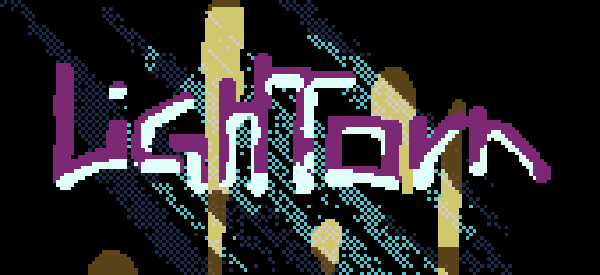

# How to play ?

Grip the lightball with `space` (keep pressed or you'll fall). Move with the `left` and `right` arrows. That's it!

# Where I looked

- ECS inspired by [Austin Morlan ECS](https://austinmorlan.com/posts/entity_component_system)
- Rain effect inspired by [Neo-Oli Rain](https://github.com/Neo-Oli/rain)
